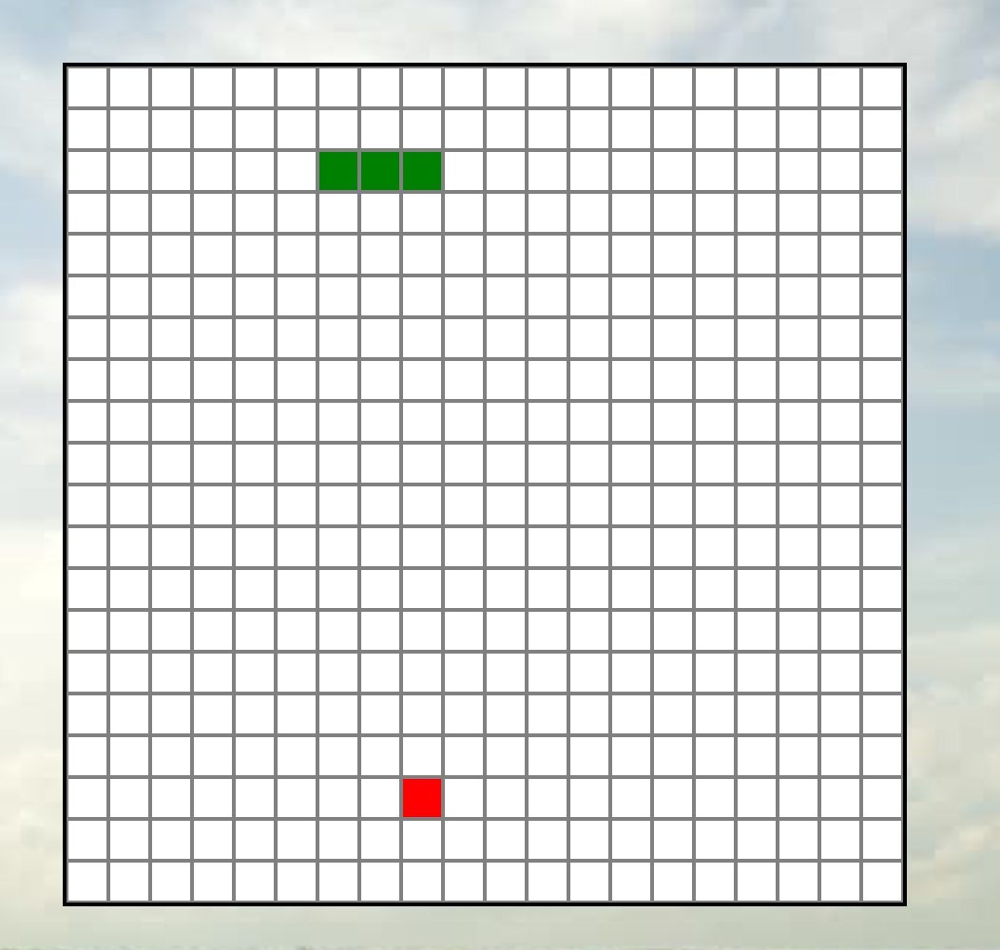

# SDOM
## SDOM-Snake [Demo](https://www.sywu.us/SDOM-Snake/)

SDOM is a JavaScript DOM interaction library built base on jQuery.
SDOM can:
  * Select single or multiple DOM elements by passing a string - example:('div')
  * Select and manipulate DOM elements
  * Create DOM elements
  * Queue callback functions until DOM is fully loaded
  * Simplify HTTP requests

## Getting Started

The quickest way to get started with SDOM is to download this library into your project and include the webpack output `SDOM.js` in your source code.

---
For testing purposes
```html
<!DOCTYPE html>
<html>
  <head>
    <meta charset="utf-8">
    <title>SDOM</title>
    <script src="https://ajax.googleapis.com/ajax/libs/jquery/3.2.1/jquery.min.js"></script>
    <script type="text/javascript" src="lib/SDOM.js" charset="utf-8"></script>
  </head>
```
---

Alternatively, user can use the documents in the `lib` folder by running `webpack --watch lib/main.js lib/SDOM.js` to recreate the webpack file.

---
## API

[`$s`](#s)  

[DOM Traversal](#dom-traversal)
  * [`children`](#children)  
  * [`parent`](#parent)  

[DOM Manipulation](#dom-manipulation)  
  * [`html`](#html)  
  * [`empty`](#empty)  
  * [`append`](#append)  
  * [`remove`](#remove)  
  * [`attr`](#attr)  
  * [`addClass`](#addclass)  
  * [`removeClass`](#removeclass)  
  * [`toggleClass`](#toggleclass)  

[Event Listeners](#event-listeners)  
  * [`on`](#on)  
  * [`off`](#off)  

[`$s.ajax`](#sajax)  

---
### $s

The SDOM library utilizes the global variable of `$s` as a wrapper for all of the methods in the SDOM library.  

1. `$s` is most commonly used to select elements with CSS selectors. `$s("div")` returns a `DOMNodeCollection` object which is an array of `HTMLElements` (Nodes) that can call methods within the SDOM library.

2. `$s` can build `DOMNodeCollection` object by passing `HTMLElement` as argument which allow the Nodes to access methods within the SDOM library.

3. `$s` can also queue functions to run as soon as the document content is loaded and ready.

---
### DOM Traversal

#### `children`

Returns a `DOMNodeCollection` object containing the DIRECT children of each Node.

#### `parent`

Returns the `DOMNodeCollection` object containing the parentNode of each and used visted to eliminate duplication.

---
### DOM Manipulation

#### `html`

If argument is given, update each Node's innerHTML content. Otherwise return the innerHTML of the first Node within the `DOMNodeCollection` object.

#### `empty`

Clear all innerHTML of each Node within the `DOMNodeCollection` object.

#### `append`

Able to accept 3 kinds of arguments that:
  `string` add argument to the end of each `DOMNodeCollection` element.
  `htmlElement` add as a childNode to each `DOMNodeCollection` element.
  `DOMNodeCollection` same as above but as multiple childNodes to each `DOMNodeCollection` element.

#### `remove`

Remove each `DOMNodeCollection` element from the DOM.

#### `attr`

Can take up to 2 arguments that:
  1 argument will return the attribute value of the first element within the `DOMNodeCollection`.

  2 arguments will update each `DOMNodeCollection` elements, giving the first argument as attribute name and second as value.

#### `addClass`

Add class to each element within the `DOMNodeCollection`.

#### `removeClass`

Remove class from the each `DOMNodeCollection` element by passing the class name.

---
### Event Listeners

#### `on`

Adds event listener to each `DOMNodeCollection` element. Callback function is saved within each element for easy removal.

#### `off`

Removes event listener from each `DOMNodeCollection` element by just passing in the EventListener type.

### $s.ajax

Sends HTTP Request and returns a `Promise` object.  Accepts a `Hash` object as an argument with any of the following attributes:
  * method (default: `"GET"`): HTTP Request method or type
  * url (default: `window.location.href`): URL for HTTP Request
  * success: `success callback`
  * error: `error callback`
  * contentType (default: `json`)


---
# Demo - Snake
This demo is created using SDOM library to manipulate one `htmlElement` that I named `snake`.

---
```html
<div class="mid">
  <h1>SDOM Snake</h1>
  <snake> </snake>
</div>
```
---
```javascript
  $s( () => {
    const root = $s('snake');
    new Snake(root);
  });
  ```
---
```javaScript
this.setBoard();

setBoard(){
  for( let i = 0; i < 400; i++) {
    this.root.append(`<li key=${i}></li>`);
  }
}
```

Using the `append` function we then able to create the mini square blocks with the help of `CSS`. `CSS` also help us shape the board size.

```CSS
snake {
  margin: 50px;
  display: flex;
  width: 440px;
  height: 440px;
  flex-wrap: wrap;
  Border: 2px solid Grey;
}

li {
  list-style: none;
  border: 1px solid Gray;
  width: 20px;
  height: 20px;
  background-color: White;
}
```



* Once the board is setup, we can manually capture the beginning snake segment `li`s and store it in an array.
* Using callback function, we can create the snake movement using the logic of a `Queue`. We `push` in a `li` into the snake array and `shift` the oldest `li`. But we need use addClass to the `li` we pushing and removeClass to the `li` we shifting.

```JavaScript
this.snake.push(this.board[this.head]);
this.snakeDomSegs.forEach( (el) => (el).addClass('snake'));

let tail = $s(this.snake.shift());
tail.removeClass('snake');
```

Then again we use CSS to draw our snake.
```CSS

.snake {
  background-color: Green;
}
```
